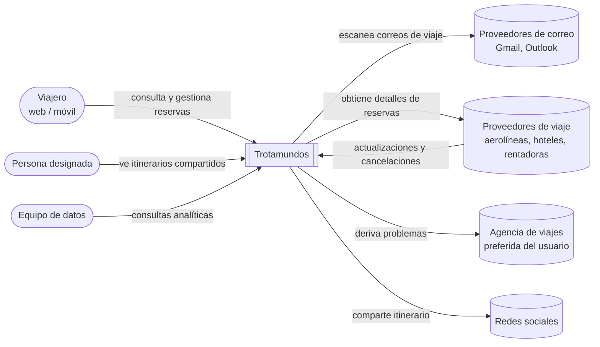

# Análisis inicial y drivers arquitectónicos

> Etapa previa a las iteraciones de ADD. Define el alcance del sistema **Trotamundos** y el conjunto priorizado de drivers (funcionalidad primaria, atributos de calidad y restricciones) que se mantendrán **inmutables** durante el proceso de diseño.

**Estado:** Completo
**Última actualización:** 08/10/2026

---

## 1. Objetivo

Identificar el alcance del sistema, sus límites e interacciones con actores externos, y priorizar los requerimientos funcionales y de atributos de calidad que guiarán las iteraciones de ADD.

---

## 2. Diagrama de contexto

---

## 3. Requerimientos funcionales

### 3.1 Funcionalidad primaria (drivers de ADD)

| ID | Caso de uso | Justificación |
|---|---|---|
| CU-01 | Consultar el panel de viajes (web y móvil) | Es la propuesta de valor del producto ("único punto de verdad") y concentra la mayor parte del tráfico. Sobre él recaen los requisitos de tiempo de respuesta, disponibilidad y picos de carga. |
| CU-02 | Recibir actualizaciones y cancelaciones de proveedores | Es el camino del requisito de 5 minutos y el más afectado por disrupciones masivas. Obliga a una arquitectura orientada a eventos. |
| CU-03 | Incorporar reservas desde el correo | Es el diferencial del producto. Involucra seguridad (acceso al correo), interoperabilidad con proveedores de correo y el mayor desafío de escala. |
| CU-04 | Compartir un itinerario con personas designadas | Es la forma concreta que toma el requisito de seguridad y privacidad en el enunciado. |

### 3.2 Funcionalidad secundaria (se implementa, no guía el diseño)

| ID | Caso de uso | Tratamiento |
|---|---|---|
| CU-05 | Analítica de datos | Se diseña su aislamiento del sistema operativo; en el prototipo se limita a publicar eventos. |
| CU-06 | Gestión manual de reservas (alta, modificación, baja) | Se implementa completo. Es la forma más simple de cargar datos en el prototipo. |
| CU-07 | Agrupar reservas por viaje y archivado automático | Se resuelve con el modelo de dominio y una tarea programada. |
| CU-08 | Filtros y *whitelists* de remitentes | Paso de filtrado dentro del pipeline de CU-03. |
| CU-09 | Resolución de problemas con la agencia de viajes | Adaptador contra una agencia simulada. |

---

## 4. Atributos de calidad

Las medidas marcadas con \* fueron propuestas por el equipo para que el escenario sea verificable; el enunciado no las define.

| ID | Atributo | Escenario | Caso de uso | Prioridad | Dificultad |
|---|---|---|---|---|---|
| QA-1 | Performance | El sistema deberá mostrar en el panel las actualizaciones generadas por un proveedor externo en menos de 5 minutos. | CU-01, 02 | Alta | Alta |
| QA-2 | Performance | El sistema deberá responder las solicitudes del panel web en menos de 800 ms con carga normal. | CU-01 | Alta | Media |
| QA-3 | Performance | La aplicación móvil deberá lograr el primer despliegue de contenido (*First Contentful Paint*) en menos de 1,4 segundos. | CU-01 | Alta | Baja |
| QA-4 | Performance | Las consultas analíticas pesadas no deberán aumentar el tiempo de respuesta del panel en más de un 10%\*. | CU-05, 01 | Baja | Media |
| QA-5 | Disponibilidad | El sistema deberá tolerar la caída de una instancia o de una zona sin superar 5 minutos mensuales de inactividad no planificada (≈ 99,99%). | CU-01, 02, 03, 04 | Alta | Alta |
| QA-6 | Disponibilidad | Si la API de un proveedor deja de responder, el sistema deberá seguir mostrando la última versión conocida del viaje, sin perder eventos al recuperarse. | CU-01, 02 | Media | Media |
| QA-7 | Escalabilidad | El sistema deberá soportar 15 M de cuentas y 2 M de usuarios activos semanales, y ante picos de hasta ×10\* seguir cumpliendo QA-1 y QA-2. | CU-01, 02 | Alta | Alta |
| QA-8 | Escalabilidad | El sistema deberá procesar el correo de 15 M de cuentas con una demora máxima de 15 minutos\* para usuarios con viajes próximos. | CU-03 | Media | Alta |
| QA-9 | Interoperabilidad | El sistema deberá integrarse con proveedores mediante APIs estándar, traduciendo sus mensajes a un modelo canónico; incorporará el 100% de los mensajes válidos y derivará los inválidos a una cola de errores. | CU-02 | Alta | Media |
| QA-10 | Interoperabilidad | El sistema deberá extraer correctamente la reserva del 95%\* de los emails de remitentes en la *whitelist*, dentro de los formatos soportados. | CU-03 | Alta | Alta |
| QA-11 | Seguridad | El sistema deberá acceder al correo solo mediante tokens OAuth de lectura, cifrados y sin guardar contraseñas, y dejar de leerlo de inmediato si el usuario revoca el acceso. | CU-03 | Alta | Media |
| QA-12 | Seguridad | Solo las personas designadas deberán poder ver un itinerario compartido; el sistema rechazará y registrará el 100% de los accesos no autorizados. | CU-04 | Alta | Baja |
| QA-13 | Evolucionabilidad | El sistema deberá permitir incorporar un nuevo medio de transporte agregando un tipo de segmento y un adaptador, sin modificar el núcleo, en 2 días-persona\* como máximo. | CU-02, 03 | Media | Baja |
| QA-14 | Usabilidad / i18n | El sistema deberá mostrar fechas, horas y monedas en el formato y la zona horaria de la región de cada usuario. | CU-01 | Baja | Baja |
| QA-15 | Interoperabilidad | El sistema deberá permitir compartir un itinerario en redes sociales mediante un enlace de solo lectura. | CU-04 | Baja | Baja |
| QA-16 | Usabilidad | La aplicación móvil deberá aprovechar el GPS del dispositivo para enriquecer la información del viaje. | CU-01 | Baja | Media |

### 4.1 Criterio de priorización

- **Prioridad:** importancia para el objetivo central del producto, ofrecer un único punto de verdad, actualizado, para los arreglos de viaje.
- **Dificultad:** incertidumbre técnica sobre la posibilidad de cumplir el escenario (riesgo técnico, en terminología del SEI), no cantidad de trabajo.

### 4.2 Drivers arquitectónicos principales

Los escenarios de prioridad y dificultad altas son los que más condicionan la arquitectura y se abordan en las primeras iteraciones:

| Driver | Decisión de diseño que fuerza |
|---|---|
| QA-1 | Arquitectura orientada a eventos: los cambios entran por webhooks o colas, se procesan de forma asíncrona y se notifican al cliente. |
| QA-5 | Servicios sin estado y replicados en varias zonas, con health checks y base de datos con réplica y failover. |
| QA-7 | Escalado horizontal, colas que absorben ráfagas y un modelo de lectura cacheado del panel. |
| QA-10 | Pipeline de ingesta de correo aislado, con extractores intercambiables por formato. |

---

## 5. Restricciones del sistema

Decisiones que el diseño debe respetar y que no se discuten durante ADD.

| ID | Restricción | Tipo | Origen |
|---|---|---|---|
| R-1 | El sistema debe ser multiplataforma: accesible desde navegadores web (multibrowser) y desde dispositivos móviles. | Técnica | Enunciado y equipo |
| R-2 | La integración con aerolíneas, hoteles y rentadoras debe realizarse a través de las APIs estándar que esos proveedores ya exponen. El sistema se adapta a sus contratos; no puede modificarlos. | Técnica | Enunciado |
| R-3 | El acceso al correo de los usuarios debe hacerse mediante las APIs de los proveedores de correo y con autorización delegada del usuario, sin solicitar ni almacenar sus contraseñas. | Técnica | Enunciado |
| R-4 | El almacenamiento operativo debe utilizar una base de datos relacional (SQL). | Técnica (autoimpuesta) | Decisión del equipo |
| R-5 | El sistema depende de sistemas externos que no controla (proveedores de viaje, correo y agencias): su disponibilidad, formatos y límites de uso son condiciones dadas. | Técnica | Enunciado |
| R-6 | Al procesar información personal y operar en el mercado internacional, el sistema debe cumplir las normativas de protección de datos de cada región donde opere. | Legal | Enunciado |

---

## 6. Preocupaciones arquitectónicas

Aspectos que el diseño debe resolver aunque no aparezcan como requerimiento explícito.

| ID | Preocupación | Relación |
|---|---|---|
| PA-1 | Autenticación y autorización de usuarios: solo el titular puede acceder a sus reservas y a la información extraída de su correo. | QA-11, QA-12 |
| PA-2 | Manejo de fechas y horas: todos los horarios se almacenan en UTC junto con la zona horaria de origen, ya que los viajes cruzan husos horarios. | QA-14 |
| PA-3 | Registro y auditoría de accesos y de errores de integración con sistemas externos. | QA-9, QA-12 |
| PA-4 | Versionado de las APIs propias, para poder evolucionar el sistema sin romper los clientes web y móvil. | QA-13 |

---

## 7. Supuestos a validar con la cátedra

- Los tiempos de QA-1 y QA-2 se toman tal como los da el enunciado. Al medirlos en el prototipo, se considerará cumplido el escenario si la gran mayoría de las solicitudes (por ejemplo, el 95%) queda por debajo del umbral, ya que garantizarlo para el 100% no es posible.
- El factor ×10 de pico es un orden de magnitud para traducir los picos "dramáticos" del enunciado.
- El plazo de 5 minutos se interpreta como aplicable a las actualizaciones de proveedores; para el correo se propone un máximo de 15 minutos. Aunque cada consulta sea incremental (solo mensajes nuevos), sondear 15 M de casillas cada 5 minutos implicaría unas 50.000 consultas por segundo, la mayoría sin novedades. Por eso el diseño prioriza las notificaciones push de los proveedores de correo, que permiten consultar solo las casillas que recibieron mensajes.
- Las prioridades fueron estimadas por el equipo en ausencia de stakeholders.
