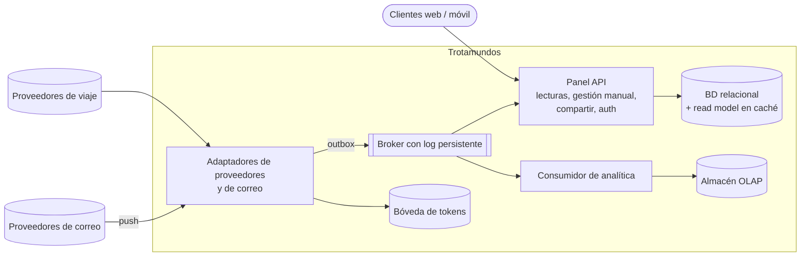

```mermaid
flowchart LR
    CL([Clientes web / móvil])
    PV[(Proveedores de viaje)]
    MC[(Proveedores de correo)]

    subgraph TROT[Trotamundos]
        direction LR
        API[Panel API<br/>lecturas, gestión manual,<br/>compartir, auth]
        ING[Adaptadores de proveedores<br/>y de correo]
        ANA[Consumidor de analítica]
        BR[[Broker con log persistente]]
        DB[(BD relacional<br/>+ read model en caché)]
        OLAP[(Almacén OLAP)]
        VAULT[(Bóveda de tokens)]
    end

    CL --> API
    PV --> ING
    MC -- push --> ING
    ING -- outbox --> BR
    BR --> API
    BR --> ANA
    API --> DB
    ANA --> OLAP
    ING --> VAULT
```
